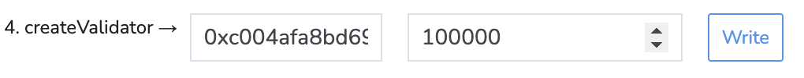

# Validator Nodes

Validator nodes are a crucial component of the X1 network.
These nodes operate as full nodes and contribute to consensus, 
thereby enhancing the network's security and facilitating the creation of new blocks.

- Minimum state requirement: 100,000 XN
- Maximum stake: 15x the minimum state amount
- Earn staking rewards and a 15% fee on delegator's rewards
- Minimum hardware requirements: AWS T2.large EC2 (or equivalent) and at least
  800GB of Amazon EBS General Purpose SSD
  (gp2) storage (or equivalent).

## Become a Validator

- Step 1: Run a full node as described [here](../getting-started) and allow it to **fully sync**.

- Step 2: Fund a wallet with enough XN to become a validator. 
At the time of writing, you need at least 100,000 XN to become a validator.
**We highly recommend using a hardware wallet.**

- Step 3: Create validator key with go-x1. Take note of the validator public key; we will need it later.
    ```shell
    x1 validator new
    ```
   
   After entering the command, you will be prompted to enter a password—use a **strong one!**
   You can, for example, use a password manager to generate a strong password to secure your wallet.

- Step 4: Place the validator password in a file.

    ```shell
    echo "MY_STRONG_PASSWORD" > /var/lib/x1/.x1/.password
    ```

- Step 5: Navigate to the [SFC Contract](https://explorer.x1-testnet.xen.network/address/0xFC00FACE00000000000000000000000000000000/write-contract#address-tabs) on the explorer.

- Step 6: Click the "Connect wallet" button and connect to your validator wallet.

   [](connect-wallet.png)

- Step 7: Enter your validator public key from step 3 and the amount of XN you want to stake, then click "Write".

   [](create-validator.png)

- Step 8: Confirm the transaction in your wallet.

- Step 9: Confirm your validator registration by searching for your validator ID on the [PWA explorer](https://pwa-explorer.x1-testnet.xen.network/staking).

- Step 10: Add the `--validator.id` and `--validator.pubkey` flags to your node's command line flags and restart your node.

    > Replace `YOUR_VALIDATOR_ID` with your validator ID and `YOUR_VALIDATOR_PUBKEY` with your validator's public key. 
    ```shell
    # Example command line flags for a validator node.
    # x1 --testnet 
    #   --syncmode snap \
    #   --validator.id YOUR_VALIDATOR_ID \
    #   --validator.pubkey YOUR_VALIDATOR_PUBKEY \
    #   --validator.password ~/.x1/.password
  
    # Use the example environment file for a validator node provided by the go-x1 package
    # and replace the placeholder values with your validator ID and public key.
    cat /system/usr/share/x1/validator-node-env \
       sed "s/VALIDATOR_ID/YOUR_VALIDATOR_ID/g" \
       sed "s/VALIDATOR_PUBKEY/YOUR_VALIDATOR_PUBKEY/g" \
     >> "$HOMEBREW_PREFIX"/etc/default/x1
   
    # or edit the environment file directly
    # sudo nano "$HOMEBREW_PREFIX"/etc/default/x1
  
    # Restart the node
    sudo systemctl restart x1.service
    ```

::: tip
Congratulations, you are now running an X1 validator node! Make sure to keep your node up and running 24 hours a day.
:::

## Register a Validator

Register a validator name and icon to help X1 delegators find you.

> Testnet contract

```solidity
0x891416e8bDB4437d4D0D303781A3828262220581
```

### Config File

Create a config file in `JSON` format that contains the following parameters (you can also leave parameters empty):

```js
{
  "name": "VALIDATOR_NAME", /* Name of the validator */
  "logoUrl": "LOGO_URL", /* Validator logo (PNG|JPEG|SVG) - 100px x 100px is enough */
  "website": "WEBSITE_URL", /* Website icon on the right */
  "contact": "CONTACT_URL" /* Contact icon on the right */
}
```

> It could look something like this 👇

```json
{
  "name": "xencrypto1",
  "logoUrl": "https://xen.network/XEN-logo-square-dark%20512x512.png",
  "website": "https://xen.network",
  "contact": "https://t.me/XENCryptoTalk"
}
```

Then host the file somewhere, so it is publicly accessible! Ex: https://x1-testnet-genesis.s3.amazonaws.com/xencrypto1.json

### Update your info in the smart contract

::: tabs

@tab From the Explorer

Visit the [ValidatorInfo](https://explorer.x1-testnet.xen.network/address/0x891416e8bDB4437d4D0D303781A3828262220581/write-proxy#address-tabs) contract in the explorer and call the `updateInfo` function with your config file URL.


Click `Write` and use your Validator wallet to sign the transaction.

@tab From the console

1. Connect to your validator node
2. Open up a x1 console session via `x1 attach`
3. Load the ValidatorInfo contract ABI and instantiate the contract

   ```solidity
   abi = JSON.parse('[{"type":"constructor","stateMutability":"nonpayable","inputs":[]},{"type":"error","name":"AddressEmptyCode","inputs":[{"type":"address","name":"target","internalType":"address"}]},{"type":"error","name":"ERC1967InvalidImplementation","inputs":[{"type":"address","name":"implementation","internalType":"address"}]},{"type":"error","name":"ERC1967NonPayable","inputs":[]},{"type":"error","name":"FailedInnerCall","inputs":[]},{"type":"error","name":"InvalidInitialization","inputs":[]},{"type":"error","name":"NotInitializing","inputs":[]},{"type":"error","name":"OwnableInvalidOwner","inputs":[{"type":"address","name":"owner","internalType":"address"}]},{"type":"error","name":"OwnableUnauthorizedAccount","inputs":[{"type":"address","name":"account","internalType":"address"}]},{"type":"error","name":"UUPSUnauthorizedCallContext","inputs":[]},{"type":"error","name":"UUPSUnsupportedProxiableUUID","inputs":[{"type":"bytes32","name":"slot","internalType":"bytes32"}]},{"type":"event","name":"InfoUpdated","inputs":[{"type":"uint256","name":"stakerID","internalType":"uint256","indexed":false}],"anonymous":false},{"type":"event","name":"Initialized","inputs":[{"type":"uint64","name":"version","internalType":"uint64","indexed":false}],"anonymous":false},{"type":"event","name":"OwnershipTransferred","inputs":[{"type":"address","name":"previousOwner","internalType":"address","indexed":true},{"type":"address","name":"newOwner","internalType":"address","indexed":true}],"anonymous":false},{"type":"event","name":"Upgraded","inputs":[{"type":"address","name":"implementation","internalType":"address","indexed":true}],"anonymous":false},{"type":"function","stateMutability":"view","outputs":[{"type":"string","name":"","internalType":"string"}],"name":"UPGRADE_INTERFACE_VERSION","inputs":[]},{"type":"function","stateMutability":"view","outputs":[{"type":"string","name":"","internalType":"string"}],"name":"getInfo","inputs":[{"type":"uint256","name":"validatorId","internalType":"uint256"}]},{"type":"function","stateMutability":"nonpayable","outputs":[],"name":"initialize","inputs":[{"type":"address","name":"initialOwner","internalType":"address"},{"type":"address","name":"sfcContractAddress_","internalType":"address"}]},{"type":"function","stateMutability":"view","outputs":[{"type":"address","name":"","internalType":"address"}],"name":"owner","inputs":[]},{"type":"function","stateMutability":"view","outputs":[{"type":"bytes32","name":"","internalType":"bytes32"}],"name":"proxiableUUID","inputs":[]},{"type":"function","stateMutability":"nonpayable","outputs":[],"name":"renounceOwnership","inputs":[]},{"type":"function","stateMutability":"view","outputs":[{"type":"address","name":"","internalType":"address"}],"name":"sfcContractAddress","inputs":[]},{"type":"function","stateMutability":"nonpayable","outputs":[],"name":"transferOwnership","inputs":[{"type":"address","name":"newOwner","internalType":"address"}]},{"type":"function","stateMutability":"nonpayable","outputs":[],"name":"updateInfo","inputs":[{"type":"string","name":"configUrl","internalType":"string"}]},{"type":"function","stateMutability":"nonpayable","outputs":[],"name":"updateSfcContractAddress","inputs":[{"type":"address","name":"sfcContractAddress_","internalType":"address"}]},{"type":"function","stateMutability":"payable","outputs":[],"name":"upgradeToAndCall","inputs":[{"type":"address","name":"newImplementation","internalType":"address"},{"type":"bytes","name":"data","internalType":"bytes"}]},{"type":"function","stateMutability":"view","outputs":[{"type":"string","name":"","internalType":"string"}],"name":"validatorInfos","inputs":[{"type":"uint256","name":"","internalType":"uint256"}]}]')
   validatorInfoContract = web3.ftm.contract(abi).at("0x891416e8bDB4437d4D0D303781A3828262220581")
   ```

4. Unlock your account

   ```solidity
   web3.personal.unlockAccount("WALLET_ADDRESS")
   ```

5. Call the `updateInfo` function of the ValidatorInfo contract (make sure you have enough XN on your wallet to cover the transaction fee)

   ```solidity
   validatorInfoContract.updateInfo("CONFIG_URL", { from: "WALLET_ADDRESS" })
   // e.g.: validatorInfoContract.updateInfo("https://x1-testnet-genesis.s3.amazonaws.com/xencrypto1.json", { from: "0xa4ddde0afdaea05a3d5a2ec6b5c7f3fc9945020b" })
   ```

:::
